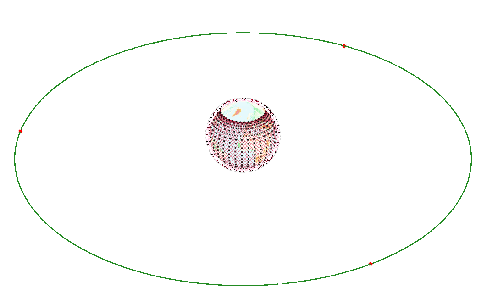
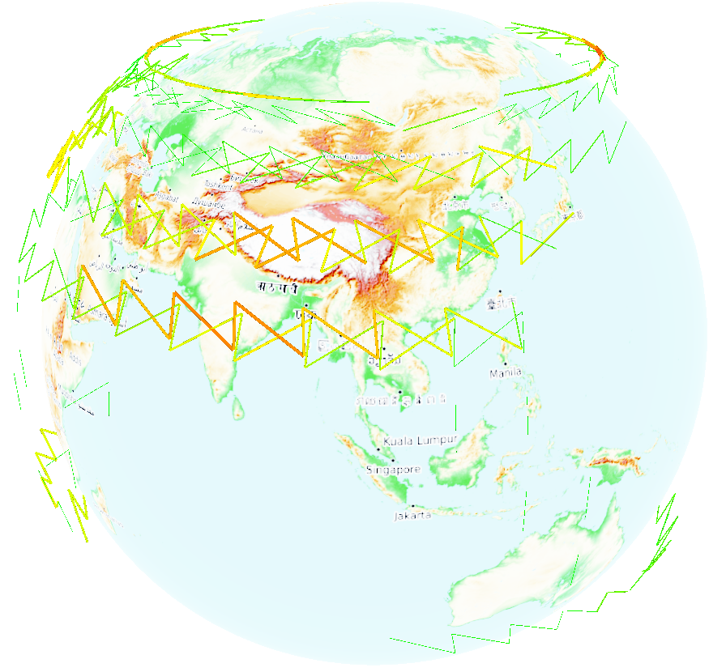
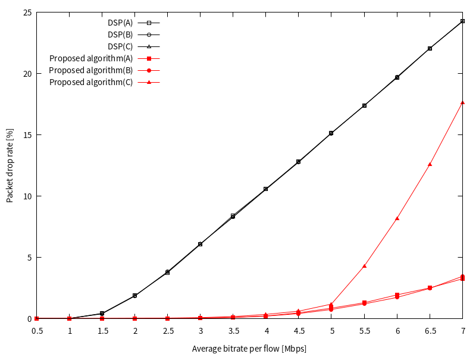
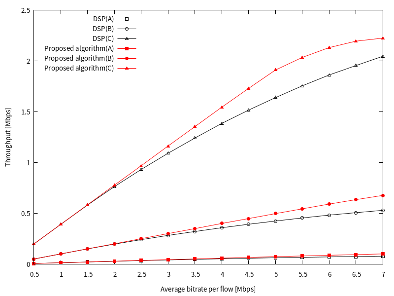
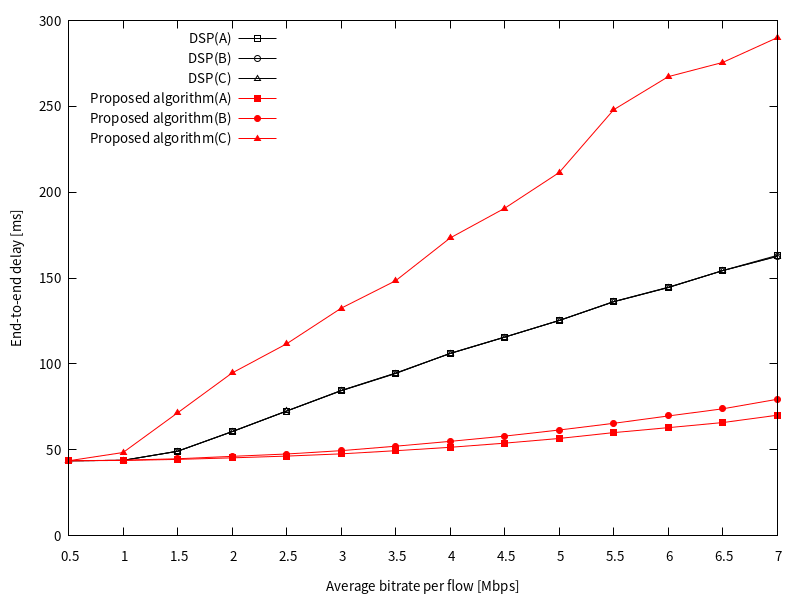
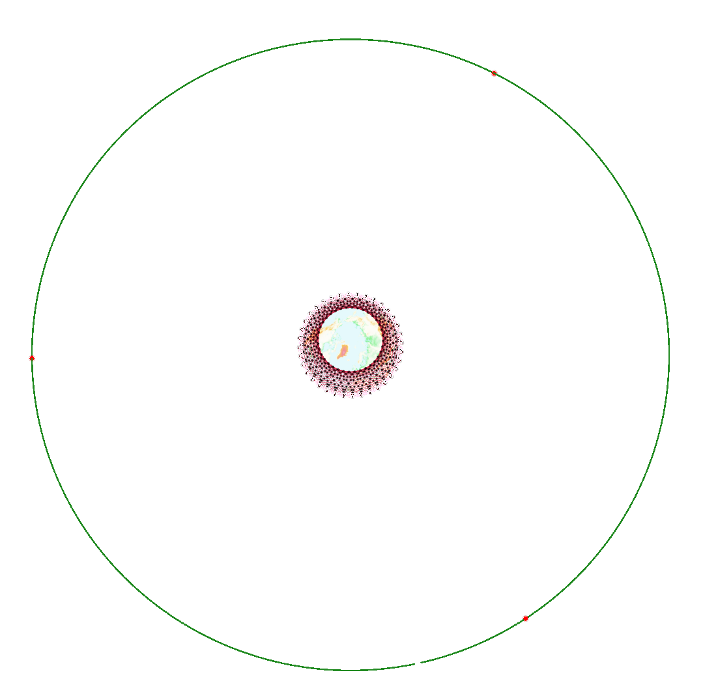
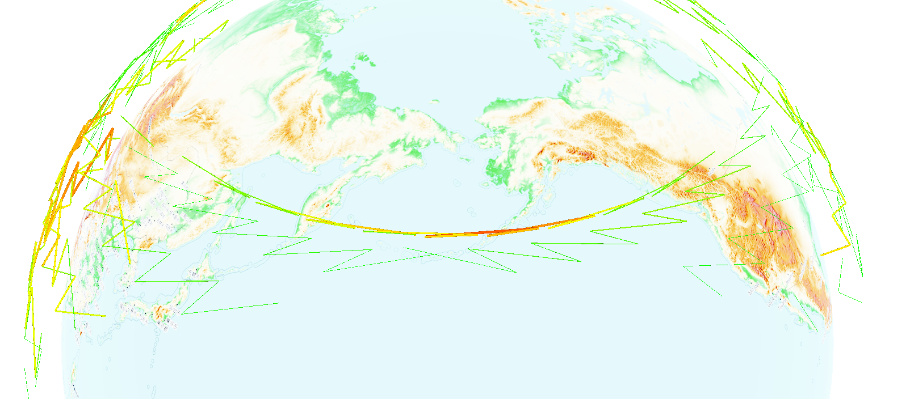
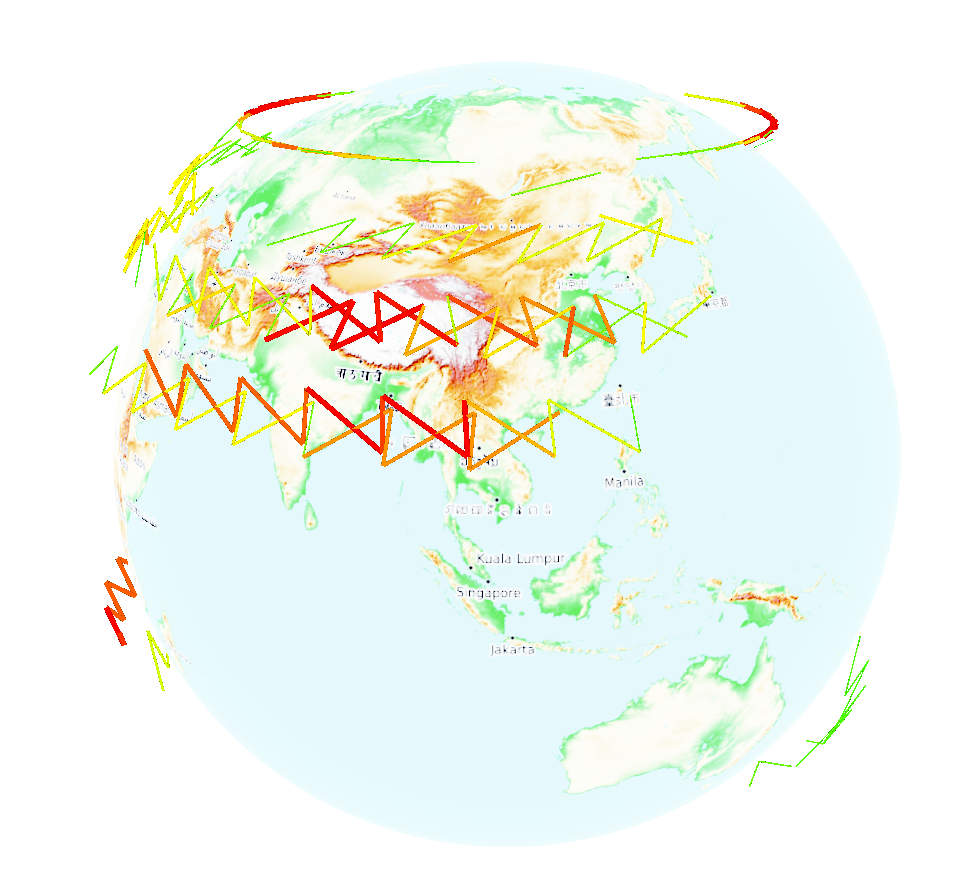
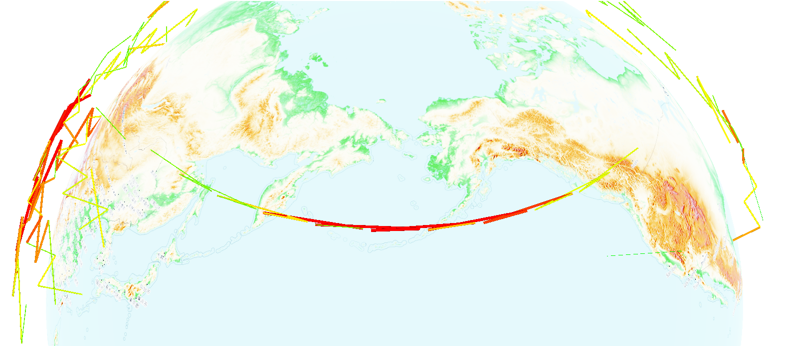

# A Dynamic Load Balancing Routing Algorithm for GEO/LEO Hybrid Satellite Networks
 
 This algorithm is a dynamic load balancing routing algorithm for GEO/LEO hybrid satellite networks. It is based on congestion prediction, and improve QoS(quality of service) by classifying network traffic. And this algorithm is implemented by [`Hypatia`](https://github.com/snkas/hypatia) framework.  
 Keyworks: **:GEO/LEO hybrid network**, **congestion prediction**, **load balancing**, **traffic classification**, **traffic detour**

 <a href="#"></a>
 <a href="#"></a>
 <a href="#"></a>

Algorithm overview:  
**Congestion prediction**: This algorithm declares the network congestion area as the congestion area, and the low-orbit satellite moving to the area can predict the congestion in advance.  
**Traffic detour**: This algorithm divides network traffic into three categories according to the sensitivity to delay, and executes different detour strategies for different traffic when the network is congested.

**Details about this algorithm can be found [`here`](doc/algorithm_details.md).**  
The paper proposing this algorithm is:
```
{
    title:      Load Balancing and QoS Provisioning Based on Congestion Prediction for GEO/LEO Hybrid Satellite Networks
    author:     Hiroki Nishiyama, Daigo Kudoh, Nei Kato and Naoto Kadowaki
    booktitle:  IEEE
    year:       2011
}
```
(In addition, **I am not the author of this algorithm**, I just implemented the algorithm in code and modified some details)

## Getting started

1. System setup:
   - Python version 3.8+
   - Recent Linux operating system (e.g., Ubuntu 20+)

2. Install Hypatia dependencies:
   ```
   bash hypatia_install_dependencies.sh
   ```
   
3. Build ns3 modules:
   ```
   bash hypatia_build.sh
   ```
   
4. Generate GEO/LEO satellite network data:  
   ```
   bash generate_satellite_network_data.sh
   ```
   (On machine with 4 cores and 4G memory, it takes about 1 hour)

5. Run ns3 to simulate:
    ```
    bash run_simulate.sh
    ```
    All simulation results and log are in `paper_routing/ns3_experiments/traffic_matrix/runs`  
    Algorithm performance picture are in `paper_routing/ns3_experiments/traffic_matrix/figures`  
    (On machine with 4 cores and 4G memory, it takes about 5~7 hour)

6. (optional) Cesium Visualization:  
    > Before generate Cesium visualization, you need:  
    > 1. Obtain a Cesium access token at [https://cesium.com/]()   
    > 2. Edit `paper_routing/ns3_experiments/traffic_matrix/satviz/static_html/top.html`, and insert your Cesium access token at line 10:
    >    ```javascript
    >    Cesium.Ion.defaultAccessToken = '<CESIUM_ACCESS_TOKEN>';
    >    ```
    After that:
    ```
    bash generate_cesium_visualization.sh
    ```
    It will generate `.html` file. You should open it with a **linux** browser(e.g., Firefox)

7. Change Parameter  
If you want to change the parameter of this algorithm, you can read the documents under `doc/`


## Visualizations
### Algorithm Performance
- Packet Drop Rate  
<a href="#"></a>
- Throughput  
<a href="#"></a>
- End-to-end delay  
<a href="#"></a>

### Cesium Visualizations
- GEO/LEO satellite network structure  
<a href="#"></a>
<a href="#"></a>
 
- this algorithm isl utilization  
<a href="#"></a>
<a href="#"></a>

- Dijkstra shortest path(DSP) isl utilization  
<a href="#"></a>
<a href="#"></a>