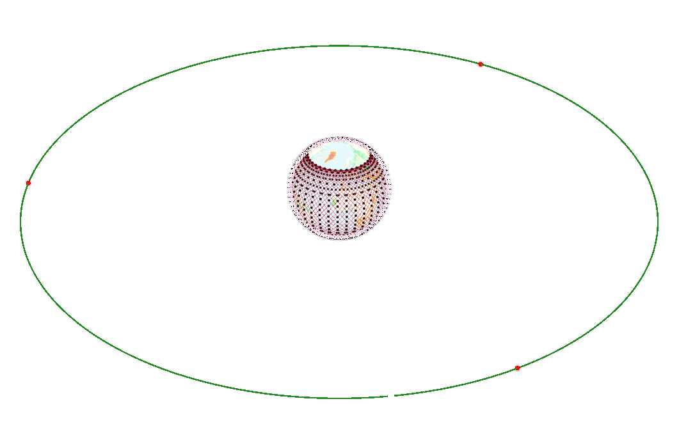

# Algorithm Details

## GEO/LEO hybrid satellite network structure
In this algorithm, we use 2 layers satellite network.  
1. LEO: The S1 layer of Starlink, which is 550km above the ground and consists of 72 orbits with 22 satellites in each orbit.
2. GEO: 3 GEO satellites(Each covers 40% of the Earth's surface)  

## Congestion Prediction
* In this algorithm, network congestion is determined by detecting whether the rate of incoming traffic rate exceeds a predefined threshold.
* In this algorithm, we **defines the network congestion area as a circle**, the center is the coordinate of the LEO satellite whose rate of incoming traffic is detected to exceed the threshold, and the radius is determined according to the satellite network configuration.
* In this algorithm, we **define LEO satellites as two states**, and the two states are introduced as follows:  
    1. Each LEO satellite defines two states: normal state and warning state. The warning state indicates that the LEO satellite is in a congested area and the load is high, and it needs to be traffic detour to balance the load.  
    2. In normal state, the LEO satellite only attempts to predict the network congestion by monitoring the incoming traffic rate, and does not carry out load balancing behavior. In warning state, not only traffic monitoring, but also **traffic detour** and **congestion information exchange** between LEO satellites are carried out.
    3. When a LEO satellite in normal state flying over a non-congested area detects that the incoming traffic rate is greater than the threshold value (represented by `M`), the LEO satellite switch from normal state to warning state, **declares the area as a congested area**, and exchanges congestion information with neighboring LEO satellites.
    4. When a LEO satellite in normal state flying over a congested area monitors that the incoming traffic rate is greater than the threshold value (represented by `N`), the satellite switch from normal state to warning state, and carries out the behavior related to warning state. Here, **the threshold N is set to be less than the threshold M, because the probability of network congestion in a congested area is greater than that in a non-congested area.** Therefore, a threshold smaller than that in a non-congested area is used to determine whether the satellite needs to switch to warning state. This also reflects the idea of "congestion prediction".
    5. When a LEO satellite in waring state detects that its incoming traffic rate is less than the threshold value (represented by `Q`), it switches from warning state to normal state, and informs the nearby LEO satellite that it does not need to traffic detour.
    6. When a LEO satellite flies over a congested area for a period of time (represented by `P`), and no traffic detour occurs during this period (that is, it never switch to warning state), the area is considered to be no longer congested, and the declaration of this congested area is cancelled.  
* The parameters mentioned above are set as follows:

|                                                                       |        |
|:---------------------------------------------------------------------:|:------:|
| Threshold for switching to warning state outside congestion area, `M` | 0.9    |
| Threshold for switching to warning state in congestion area, `N`      | 0.8    |
| Threshold for switching to normal state, `Q`                          | 0.5    |
| Time to cancel the declaration of congested area, `P`                 | 300s   |
| Radius of congestion area                                             | 1500km |
| Measurement interval of traffic rate                                  | 20ms   |

## Traffic Detour
In this algorithm, traffic is divided into three categories: A, B and C, according to the different sensitivity to delay.  
1. A: Class A traffic has the highest priority because it is most sensitive to delay. This type of traffic from applications such as VoIP and online games.  
* **This type of traffic is never detoured**, because the increase in delay caused by detouring can significantly reduce the quality of service(QoS).  
2. B: Class B traffic has the second priority because it is relatively strong robustness to delay. This type of traffic from applications such as real-time video streams and streaming media video.  
* **This type of traffic can only be detoured in LEO layer**, because it also has requirements to delay.  
3. C: Class C traffic represents best-effort services, because it is not sensitive to changes in delay. This type of traffic is more focused on throughput. This type of traffic from applications such as FTP(file transfer protocol).  
* **This type of traffic can be detoured to GEO layer**, because it is not sensitive to increases in delay.  

Here is a demonstration that requires traffic detour:  

## Code Details
The core code of this algorithm mentioned above is located in:  
`(project_dir)/ns3-sat-sim/simulator/contrib/satellite-network/model/arbiter-leo.cc, arbiter-traffic-leo.cc, arbiter-geo.cc, arbiter-gs.cc`